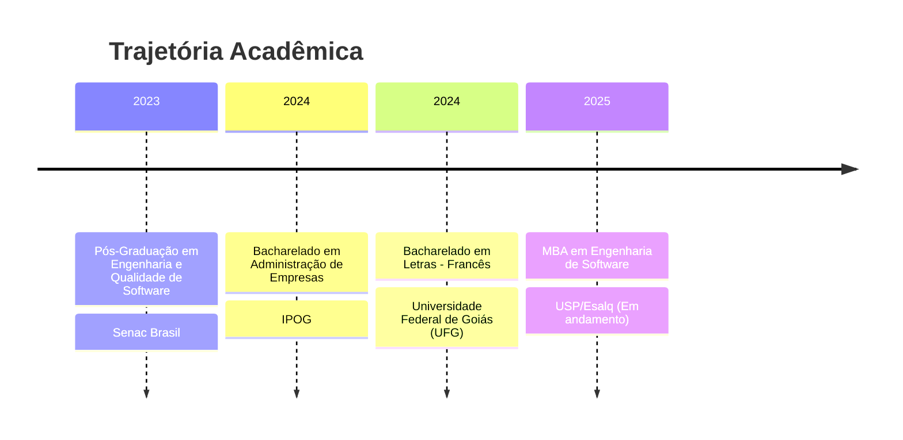

<div align="center">


<br/>

[](https://git.io/typing-svg)

<br/>

[](https://www.linkedin.com/in/lucgonp/)
[](mailto:lucpontespereira@gmail.com)
[](https://github.com/lucgonp)

<br/>

</div>

---

## 👋 Sobre Mim

Sou **Lucas Gontijo**, especialista em Qualidade de Software com atuação estratégica como **Head of QA na Sittax** e **Consultor de Qualidade** para empresas como **IF Goiano**, **Bytoken** e **SuitPay**.

Minha missão é simples: **transformar qualidade em diferencial competitivo**. Faço isso unindo pensamento estratégico, rigor técnico e uma cultura de qualidade que permeia toda a organização do código ao produto final.

```
🎯  Foco em resultados mensuráveis, não apenas em testes.
🔗  Ponte entre a área técnica e os objetivos de negócio.
📈  Qualidade como vantagem competitiva, não como custo.
```

---

## 💼 Experiência & Consultoria

| Empresa | Papel | Foco |
|---|---|---|
| **Sittax** | Head of Quality Assurance | Liderança estratégica de times QA, definição de processos e cultura de qualidade |
| **IF Goiano** | Quality Consultant | Engenharia de Software & Garantia de Qualidade |
| **Bytoken** | Quality Consultant | Estratégia de testes & automação |
| **SuitPay** | Quality Consultant | Qualidade de produto & processos ágeis |

---

## 🛠️ Stack & Expertise

<div align="center">

### 🤖 Automação & Performance
[](https://www.cypress.io/)
[](https://playwright.dev/)
[](https://k6.io/)
[](https://www.postman.com/)

### 💻 Linguagens
[](https://developer.mozilla.org/pt-BR/docs/Web/JavaScript)
[](https://www.typescriptlang.org/)
[](https://www.python.org/)
[](https://www.postgresql.org/)

### ☁️ DevOps & Infra
[](https://azure.microsoft.com/pt-br/products/devops)
[](https://github.com/features/actions)
[](https://www.docker.com/)
[](https://n8n.io/)

### 🔧 Ferramentas & Plataformas
[](https://www.notion.so/)
[](https://www.figma.com/)
[](https://www.atlassian.com/br/software/jira)

</div>

---

## 🎓 Formação Acadêmica



---

## � GitHub Stats

<div align="center">


<br/>

[](https://git.io/streak-stats)

</div>

---

## � Pilares da Minha Atuação

<div align="center">

| 🎯 Estratégia | 🤖 Automação | 📈 Performance | 🤝 Liderança |
|:---:|:---:|:---:|:---:|
| Test Planning | Cypress / Playwright | K6 Load Testing | Gestão de Times QA |
| Agile QA | API Testing | Monitoramento | Cultura de Qualidade |
| Shift-Left Testing | CI/CD Integration | Análise de Métricas | Mentoria Técnica |

</div>

---

<div align="center">


*"A qualidade não é um ato, é um hábito."* — Aristóteles

**💬 Quer transformar a qualidade da sua empresa? [Vamos conversar!](mailto:lucpontespereira@gmail.com)**

</div>
